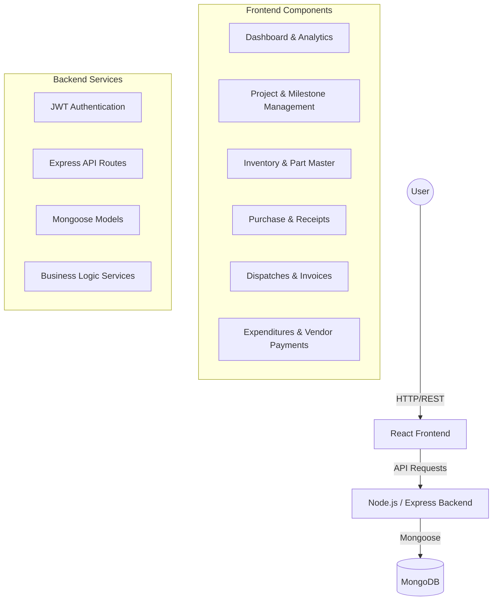

# VOOMET - Integrated Project & Resource Management System

## Overview
VOOMET is a comprehensive Enterprise Resource Planning (ERP) and Project Management solution designed to streamline manufacturing and engineering workflows. It provides a centralized platform for managing projects, tracking milestones, handling inventory, procurement, production, quality control, and financial expenditures.

---

## 🏗 System Architecture

### High-Level Diagram



---

## 🚀 Key Modules & Features

### 1. Project Management
- **Project Master**: Create and manage client projects.
- **Milestone Tracking**: Defined project phases with status tracking.
- **In-house Milestones**: Detailed internal tracking for complex operations.
- **Budgeting**: Track project budgets versus actual expenditures.

### 2. Inventory & Procurement
- **Part Master**: Centralized database for all parts and materials.
- **Inventory Management**: Real-time stock tracking and updates.
- **Purchase Request (PR)**: Internal workflow for requesting materials.
- **Purchase Order (PO)**: Generate and track orders to vendors.
- **Receipts (GRN)**: Record incoming goods against purchase orders.

### 3. Production & Quality
- **BOQ Management**: Bill of Quantities for projects.
- **Production Tracking**: Monitor manufacturing status.
- **Quality Control**: Ensure products meet standards before dispatch.

### 4. Sales & Logistics
- **Dispatches**: Manage outgoing shipments.
- **Proforma Invoices**: Generate billing documentation for clients.
- **Logistic Expenditure**: Track shipping and transport costs.

### 5. Financial Management
- **Project Expenditure**: Track costs associated with specific projects.
- **Miscellaneous Expenditure**: Log general operational costs.
- **Vendor Payments**: Manage outgoing payments to suppliers.
- **Profit & Loss Summary**: Financial health overview at project level.

### 6. Administration
- **Employee Master**: Manage staff records.
- **Access Control**: Role-based permissions for system features.

---

## 🛠 Tech Stack

- **Frontend**: React.js, Tailwind CSS, Axios, Lucide React (Icons), Recharts (Analytics).
- **Backend**: Node.js, Express.js.
- **Database**: MongoDB with Mongoose ODM.
- **Authentication**: JSON Web Tokens (JWT).
- **Reporting**: PDF generation for Invoices, BOQs, and Reports.

---

## 📁 Project Structure

```text
├── backend/
│   ├── config/         # Database and app configurations
│   ├── middleware/     # Auth and error handling middlewares
│   ├── models/         # Mongoose schemas (Project, Inventory, etc.)
│   ├── routes/         # API endpoints
│   ├── services/       # Core business logic
│   └── Server.js       # Entry point
├── frontend/
│   ├── src/
│   │   ├── components/ # Reusable UI components
│   │   ├── pages/      # Main application screens
│   │   ├── context/    # React context for state management
│   │   └── App.js      # Main router and entry point
└── README.md
```

---

## ⚙️ Getting Started

### Prerequisites
- Node.js (v14+)
- MongoDB (Local or Atlas)
- npm or yarn

### Installation

1. **Clone the repository**
   ```bash
   git clone <repository-url>
   cd voomet
   ```

2. **Backend Setup**
   ```bash
   cd backend
   npm install
   # Create a .env file with:
   # PORT=5000
   # MONGO_URI=your_mongodb_uri
   # JWT_SECRET=your_secret_key
   npm start
   ```

3. **Frontend Setup**
   ```bash
   cd ../frontend
   npm install
   # Create a .env file with:
   # REACT_APP_API_URL=http://localhost:5000/api
   npm start
   ```

---

## 📄 License
Internal Proprietary Software - VOOMET.
